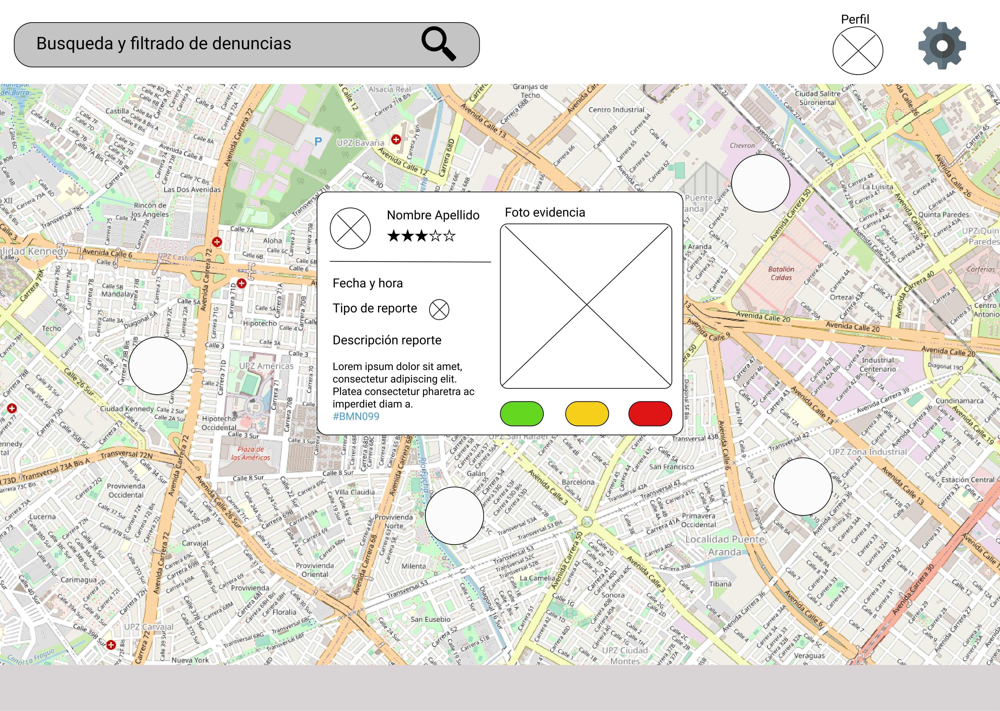
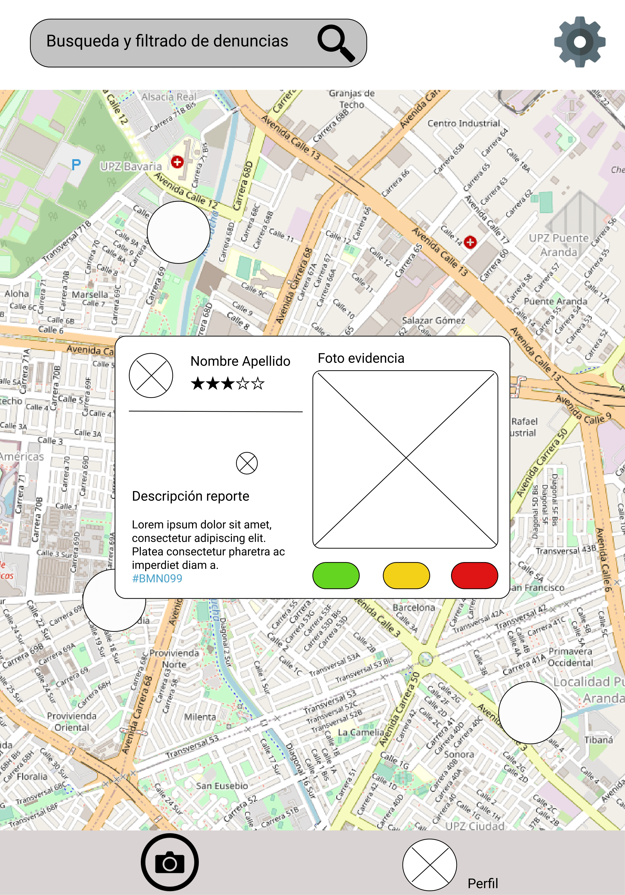
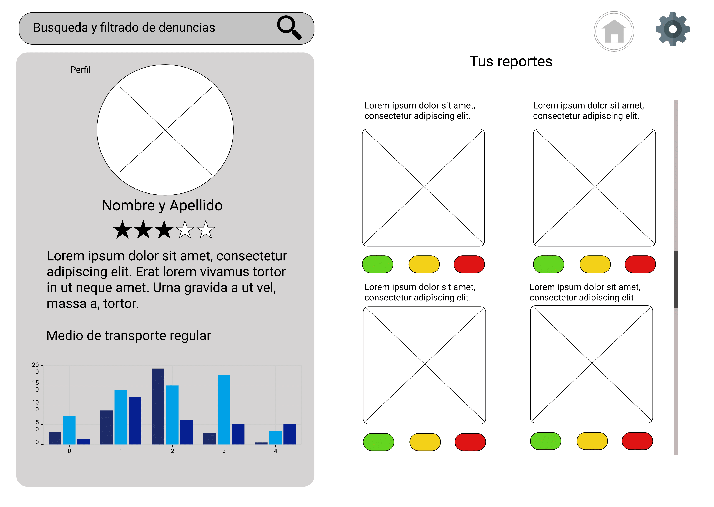
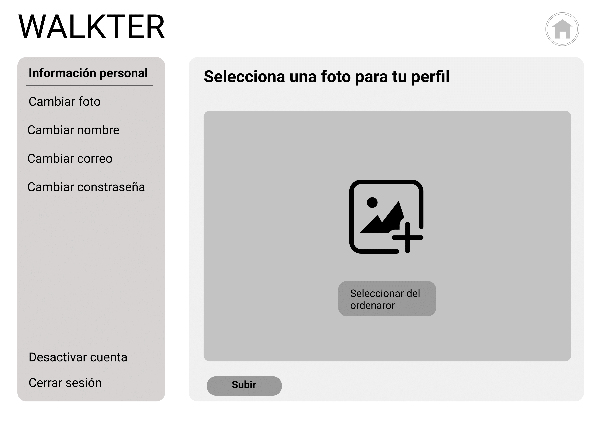
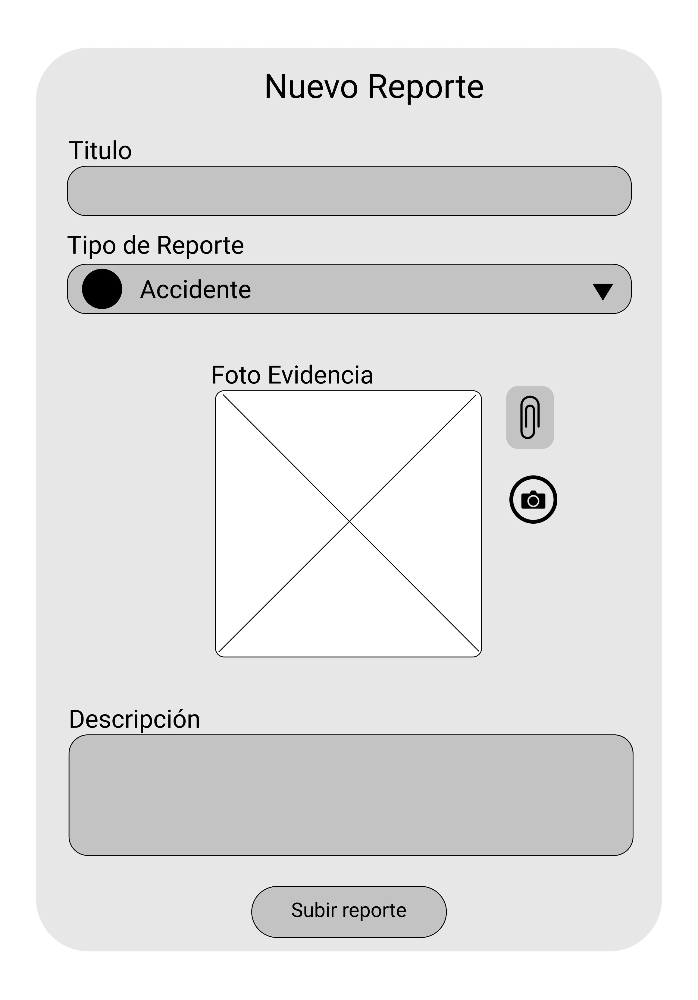
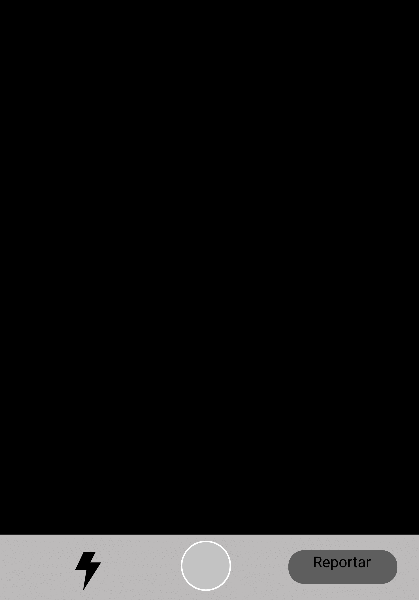

# WALKTER #

## Sobre la web ##

Proyecto: Social Network. De que trata?
Cómo descubriste las necesidades de los usuarios? 
Cómo llegaste a la definición final de tu producto?
Quiénes son los principales usuarios de producto?
Qué problema resuelve el producto / para qué le servirá a estos usuarios?

### Uso y Tutoriales ###

Puedes acceder a la versión web haciendo click [aqui](https://dsandovalm.github.io/BOG002-social-network/src/index.html)

## Sobre el diseño ##

### Prototipos ###

#### Baja fidelidad ####

- Sign in

- Sign up

- Inicio: mapa. Publicaciones en pop ups

- Perfil de usuario

- Configuración

- Creación de Publicaciones

**Feedback recibido**

#### Alta fidelidad ####
- Sign in
- Sign up
- Inicio: mapa
- Modal: publicación
- Perfil de usuario
