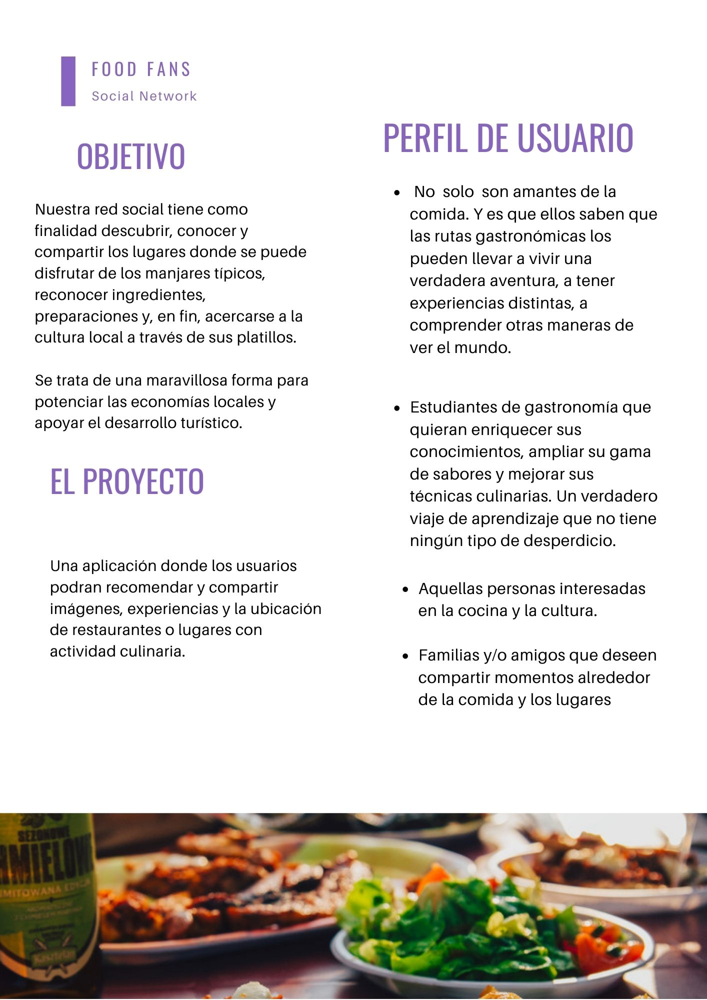

# FOODFANS

Una aplicación donde los usuarios podran recomendar y compartir  imágenes, experiencias y la ubicación de restaurantes o lugares con actividad culinaria.

## OBJETIVO

Nuestra red social tiene como finalidad descubrir, conocer y compartir los lugares donde se puede disfrutar de los manjares típicos, reconocer ingredientes, preparaciones y, en fin, acercarse a la cultura local a través de sus platillos.

Se trata de una maravillosa forma para potenciar las economías locales y apoyar el desarrollo turístico.

## PERFIL DEL USUARIO

 No  solo  son amantes de la comida. Y es que ellos saben que las rutas gastronómicas los pueden llevar a vivir una verdadera aventura, a tener experiencias distintas, a comprender otras maneras de ver el mundo.

 Estudiantes de gastronomía que quieran enriquecer sus conocimientos, ampliar su gama de sabores y mejorar sus técnicas culinarias. Un verdadero viaje de aprendizaje que no tiene ningún tipo de desperdicio.

 Aquellas personas interesadas en la cocina y la cultura.

 Familias y/o amigos que deseen compartir momentos alrededor de la comida y los lugares.

 
 
 